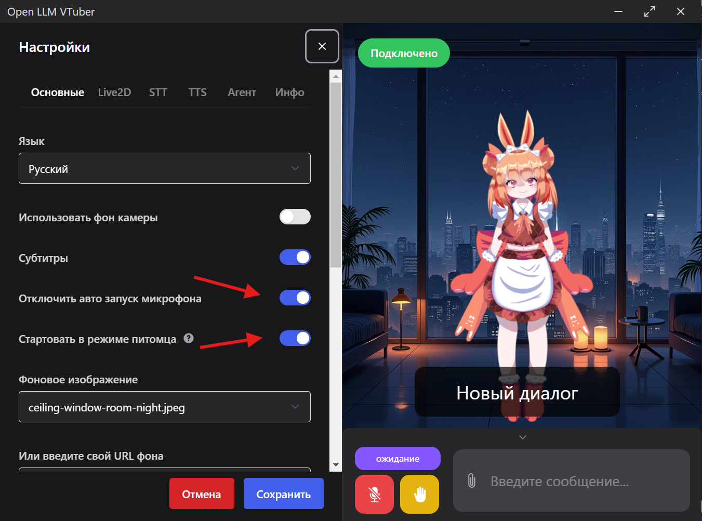

<h1 align="center">Open-LLM-VTuber — RU-Adapt-RAG</h1>
<h3 align="center">

[](https://github.com/Open-LLM-VTuber/Open-LLM-VTuber)
[](https://github.com/Open-LLM-VTuber/Open-LLM-VTuber/blob/master/LICENSE)

**Русский** | [English](README.EN.md)

</h3>

## ⭐️ О проекте

Это модификация **Open-LLM-VTuber** с поддержкой русского языка, RAG-системы и дополнительными возможностями. Голосовой AI-компаньон с Live2D-аватаром, распознаванием речи и визуальным восприятием. Работает офлайн. Платформа: Windows.

### 👀 Демо



**Видео:**

<video src="assets/demo_video_1.mp4" controls width="500"></video>  
<video src="assets/demo_video_2.mp4" controls width="500"></video>

## ✨ Что нового в моде RU-Adapt-RAG

- **Автозапуск в режиме питомца** — приложение стартует сразу в режиме питомца без главного окна
- **Микрофон выключен при старте** — включается вручную
- **Окно RAG-системы** — отдельное окно для настройки RAG: подключение документов и чатов, семантический поиск
- **Меню для RAG** — быстрый доступ к настройкам и управлению базами знаний
- **Лёгкая установка Live2D-моделей** — добавление и смена персонажей через меню
- **Лёгкая подгрузка Live2D** — модели грузятся в фоне, интерфейс не блокируется
- **Модель эмбединга BGE-M3 (BorisTM/bge-m3_en_ru)** — многоязычная модель, подходит для русского и английского
- **Без эмоций в тексте** — убраны эмоции, которые оригинальная версия писала в ответах (например, *улыбается*), теперь только естественная речь

## 📚 RAG-система

RAG — это «память» персонажа. Он запоминает ваши диалоги и то, что вы ему показываете в документах. Когда вы задаёте вопрос, персонаж ищет похожие темы в чатах и файлах и отвечает, опираясь на этот контекст. Получается живой собеседник, который помнит разговоры и использует ваши материалы, а не отвечает «из пустоты». Всё управление RAG — прямо из настроек: можно добавлять документы, подключать чаты и настраивать базу знаний без правки файлов.

## 🔊 TTS (речь)

**Silero TTS** — качественный локальный русский голос, полностью офлайн. Модели v5_1_ru, v5_ru, v4_ru подгружаются через torch.hub.

## 🎭 Быстрая смена Live2D-модели

Новое меню позволяет менять персонажа без правки конфигов. Достаточно положить папку с Live2D-моделью в `live2d-models/` — она появится в меню, и можно переключаться в пару кликов. Удобно пробовать разных персонажей и подбирать подходящего без лишних действий.

## 📌 Закрепление персонажа на экране

В режиме питомца персонажа можно закрепить в нужном месте экрана и выбрать план: **передний** (поверх всех окон) или **задний** (под окнами, виден только на фоне рабочего стола). Перетащите персонажа туда, где удобно, и выберите, должен ли он всегда быть на виду или оставаться в фоне.

## 🚀 Запуск

### Сборка
См. [Quick Start](https://open-llm-vtuber.github.io/docs/quick-start). Установите зависимости: `uv sync`. Соберите фронтенд (если нужно) в `frontend/`.

### Запуск через bat
```bat
start.bat
```
Или `start_ru.bat` для русской конфигурации.

### Запуск exe (десктоп-клиент)
После сборки — exe в `frontend/release/` (либо через npm run build в frontend). Запустите собранный exe — он подключится к серверу.

### Запуск сервера вручную
```bat
uv run run_server.py
```

## 🤗 Вклад

[Development guide](https://docs.llmvtuber.com/docs/development-guide/overview)

## 📜 Лицензии

Live2D-модели распространяются по отдельной лицензии Live2D Inc.
